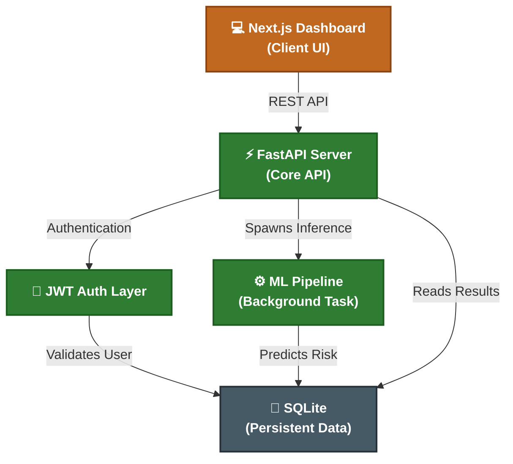
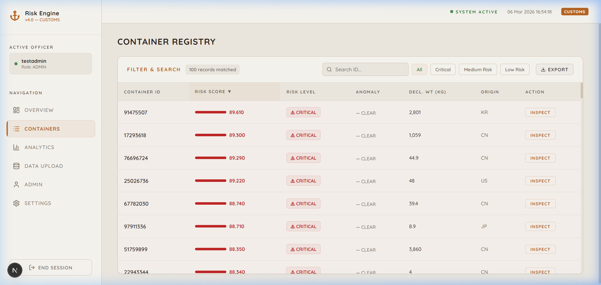
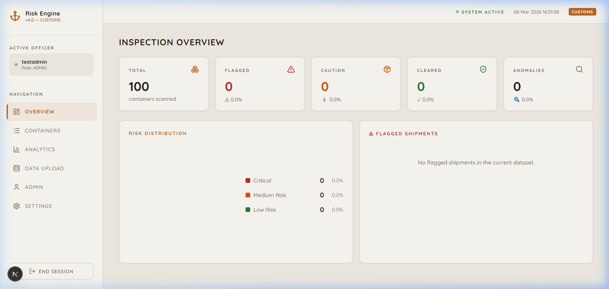
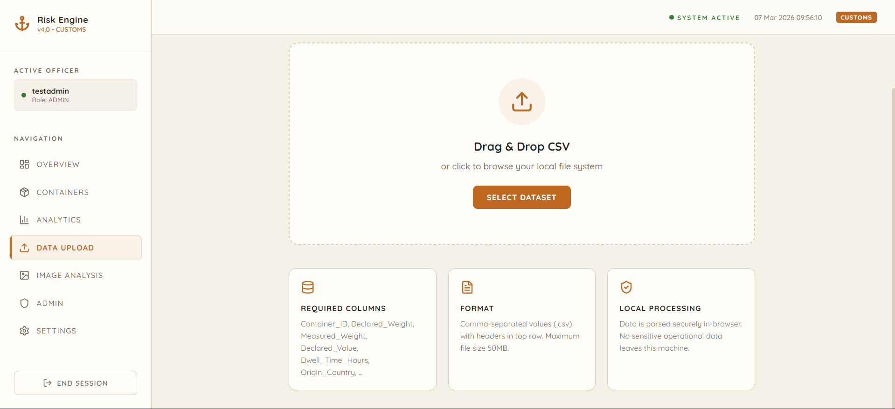
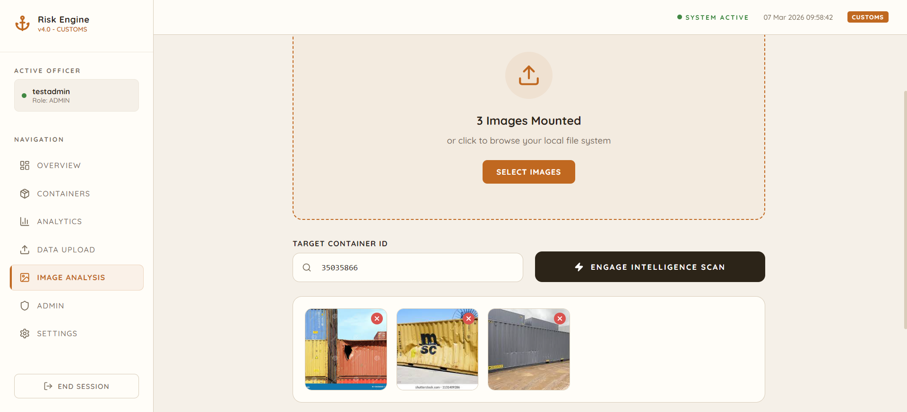
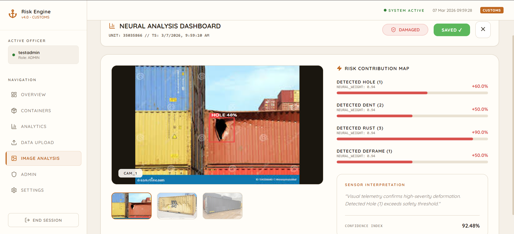
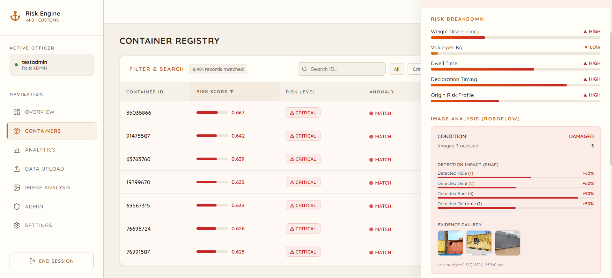
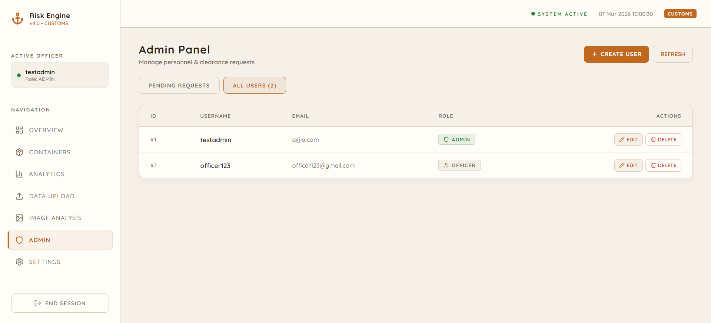

<div align="center">
  
  <h1 align="center">SmartContainer Risk Engine v4.0</h1>
  <p align="center">
    <strong>Next-Generation AI Customs Intelligence & Targeting Platform</strong>
    <br />
    <br />
    <a href="#-solution-overview">Overview</a>
    ·
    <a href="#-architecture">Architecture</a>
    ·
    <a href="#-tech-stack">Tech Stack</a>
    ·
    <a href="#-live-demo--screenshots">Screenshots</a>
    ·
    <a href="#-team">Team</a>
  </p>
  <p align="center">
    <strong>Team: Prototype Zero</strong>
  </p>
</div>

<hr />

## 📚 Documentation

For a deep dive into our methodology, system design, and technology choices, please refer to the following specific documents:

- **[🏗️ System Architecture](docs/ARCHITECTURE.md)**: Details the frontend SPA structure, core API endpoints, ML pipeline data flow, and ensemble architecture.
- **[🎯 Solution Approach](docs/SOLUTION_APPROACH.md)**: In-depth explanation of our approach, including feature engineering, the multi-model ensemble (XGBoost, LightGBM, Isolation Forest), rule-based algorithms, and computer vision image analysis.
- **[🛠️ Tech Stack](docs/TECH_STACK.md)**: Detailed breakdown of the libraries, infrastructure, and rationale for choosing each piece of technology in the stack.

---

## 🌟 Solution Overview

The **SmartContainer Risk Engine** is an enterprise-grade, microservices-based application designed for modern customs agencies. It ingest vast amounts of shipping manifest data, utilizes Isolation Forest anomaly detection algorithms, and evaluates cargo risk in real-time.

By intelligently parsing manifest data, dwelling times, declared weights vs. actual weights, and historical trade patterns, the system automatically triages incoming shipments into **Low**, **Medium**, and **Critical** risk tiers—enabling customs officers to focus physical inspections exactly where they are needed most.

### Key Capabilities

- 🔥 **Real-time Anomaly Detection**: Statistical anomaly flagging using AI/ML algorithms.
- 👨‍⚖️ **Role-Based Access Control (RBAC)**: Distinct permissions for `Admin`, `Officer`, and `Pending` users.
- 📊 **Dynamic Analytics Dashboard**: Rich data visualizations built with Recharts.
- 💨 **In-Process Background Tasks**: Fast execution of ML inference without external brokers.
- 🛡️ **JWT Authentication**: Secure, token-based API communication.
- 🖼️ **Image Damage Analysis**: Container damage detection identifying dents, rust, holes, and framing issues using Roboflow.

---

## 🏗️ Architecture

The system is built on a decoupled, asynchronous microservices architecture to ensure high throughput and independent scaling of the intelligence tier.



---

## 💻 Tech Stack

### Frontend Architecture

| Technology   | Badge                                                                                                      | Description                                                |
| ------------ | ---------------------------------------------------------------------------------------------------------- | ---------------------------------------------------------- |
| **Next.js**  |    | React framework mapped as a Single Page Application (SPA). |
| **React**    |         | Core component UI framework.                               |
| **Recharts** |  | Native React UI charting library for dashboard analytics.  |
| **Lucide**   |    | Clean and modern application iconography.                  |

### Backend, ML, & Database

| Technology       | Badge                                                                                                                          | Description                                               |
| ---------------- | ------------------------------------------------------------------------------------------------------------------------------ | --------------------------------------------------------- |
| **Python**       |                    | Core language for backend and ML modeling.                |
| **FastAPI**      |                | High performance asynchronous API framework.              |
| **SQLite**       |                         | Embedded persistence for roles, users, and API data.      |
| **Scikit-Learn** |  | Utilized for Isolation Forest and core feature pipelines. |
| **XGBoost**      |                                              | Primary machine learning ensemble model weight.           |
| **LightGBM**     |                                            | Secondary machine learning ensemble model weight.         |
| **Roboflow**     |                                         | Used to execute advanced CV models for container damage.  |

---

## 📸 Live Demo & Screenshots

### Demo Credentials

To explore the system locally, use the following seeded administrator credentials:

- **Officer ID (Username)**: `testadmin`
- **Security Access Code (Password)**: `password123`

### 1. Secure Authentication Portal

_Role-based access gateway for customs personnel._


### 2. High-Level Intelligence Overview

_Real-time metrics tracking flagged shipments, anomalies, and active system health._


### 3. Container Risk Registry

_Detailed triage view featuring the dynamic `RiskBar` component with deep ML scoring._


### 4. Deep Analytics (Part 1)

_Comprehensive breakdown of risk metrics, origins, and distributions._


### 5. Deep Analytics (Part 2)

_Correlation analysis and temporal risk mapping for deeper intelligence._


### 6. Data Upload & Processing

_Secure Drag & Drop interface for processing large container manifest datasets._


### 7. Mounted Image Analysis

_Visual inspection module for isolating target containers and analyzing telemetry._


### 8. Neural Analysis Dashboard

_Roboflow-powered damage detection with active condition risk contribution mapping._


### 9. Extended Registry Context

_Granular risk breakdown and evidence gallery exposed within the registry sidebar._


### 10. Administrator Control Panel

_Comprehensive user management and role-based security clearance tracking._


---

## 🚀 Getting Started

### Prerequisites

- Python 3.9+
- Node.js 18+

### Installation

**1. Clone the repository**

```bash
git clone https://github.com/Priyansh9506/Prototype-Zero-v2.git
cd Prototype-Zero-v2
```

**2. Setup Backend (FastAPI)**

```bash
python -m venv venv
source venv/bin/activate  # Or `venv\Scriptsctivate` on Windows
pip install -r requirements.txt
python verify_user.py      # Seed the admin database

# Start with isolated watcher to avoid frontend compilation loops
python -m uvicorn api.main:app --reload --reload-dir api --reload-dir src --port 8000
```

**3. Setup Frontend (Next.js)**

```bash
cd dashboard
npm install --force       # Use --force if you encounter permission (EPERM) issues
npm run dev
```

**4. Access the Dashboard**
Navigate your browser to `http://localhost:3000`.

---

## 👥 Team

| Name           | Role                               | GitHub Profile                                    |
| -------------- | ---------------------------------- | ------------------------------------------------- |
| Kaivalya Bhatt | Team Leader/Frontend & ML Engineer | [KaivalyaBhatt](https://github.com/KaivalyaBhatt) |
| Priyansh Patel | Full Stack & ML Engineer           | [PriyanshPatel](https://github.com/Priyansh9506)  |
| Yashi Jain     | Data & UX Engineer                 | [YashiJain](https://github.com/Yashi1609)         |
| Rutva Patel    | Computer Vision & ML Engineer           | [RutvaPatel](https://github.com/Rutva-11)         |

---

## 🛠️ Troubleshooting

### Windows Compilation Loop

If you find the backend restarting infinitely when the frontend compiles, ensure you are running the backend with `--reload-dir api --reload-dir src`. This prevents Uvicorn from watching the `.next` build folder.

### Missing Dependencies

If you encounter `Module not found` in the frontend terminal, try clearing the cache and reinstalling:

```bash
rmdir /S /Q .next
npm install --force
npm run dev
```

---

<div align="center">
  <p><strong>Prototype Zero · Advancing intelligent risk detection for global trade systems.</strong></p>
</div>
