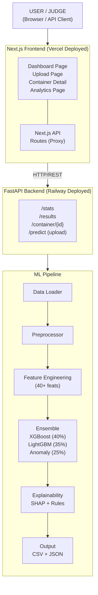
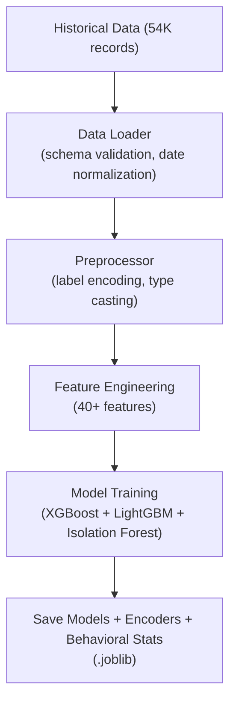
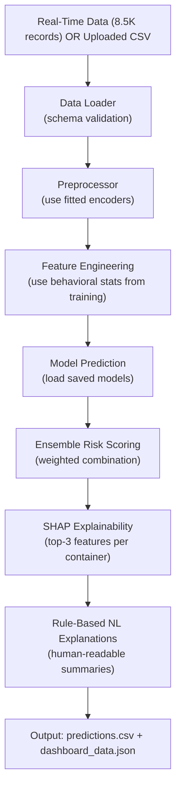
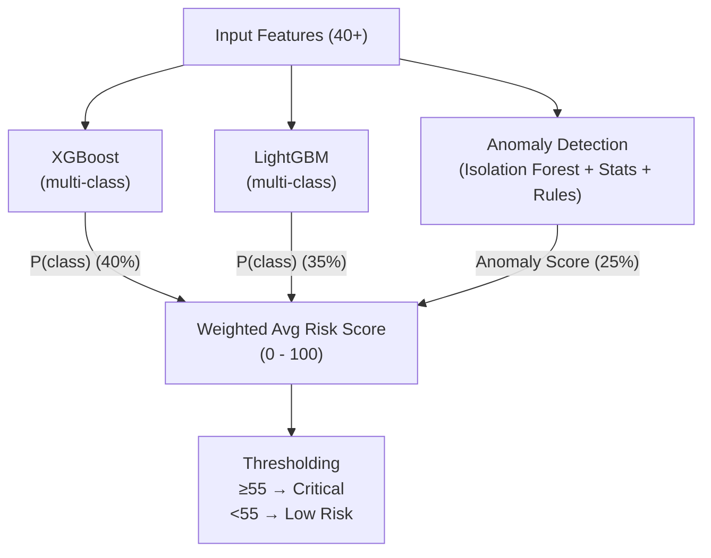

# 🏗️ System Architecture

## High-Level Overview

## Data Flow

### Training Flow

### Inference Flow

## API Endpoints

| Method | Endpoint                              | Description                                     |
| ------ | ------------------------------------- | ----------------------------------------------- |
| `GET`  | `/`                                   | Health check                                    |
| `GET`  | `/stats`                              | Dashboard summary statistics                    |
| `GET`  | `/results?page=1&risk_level=Critical` | Paginated results with filtering                |
| `GET`  | `/container/{id}`                     | Single container detail + SHAP explanation      |
| `GET`  | `/predictions`                        | All predictions (CSV format)                    |
| `POST` | `/predict`                            | Upload CSV → run inference → return predictions |
| `GET`  | `/feature-importance`                 | Global feature importance ranking               |

## Ensemble Model Architecture

