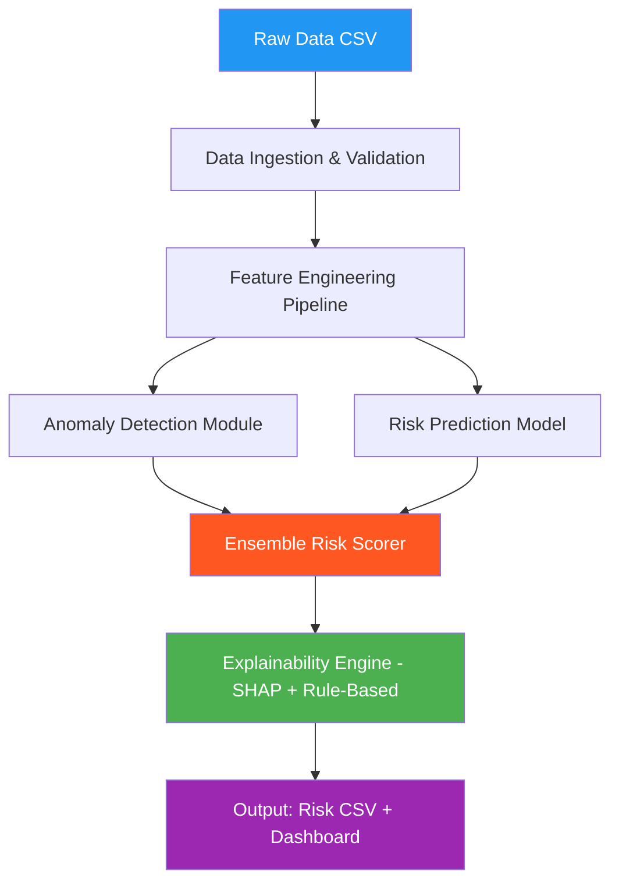

# 🚀 HACKaMINeD - SmartContainer Risk Engine
## Complete Problem Analysis & State-of-the-Art Solution Blueprint

---

## 📋 Problem Statement Summary

Build an **AI/ML-based SmartContainer Risk Engine** that:
1. **Predicts** a Risk Score (0-100) for each container
2. **Categorizes** containers into **Critical** / **Low Risk** levels
3. **Detects anomalies** (weight discrepancies, suspicious value-to-weight ratios, behavioral irregularities)
4. **Explains** each prediction with 1-2 line summaries
5. **Generates** a CSV output + Summary Dashboard

---

## 📊 Dataset Analysis

### Historical Data (Training)
| Property | Value |
|---|---|
| **Records** | 54,000 rows × 16 columns |
| **Date Range** | Jan 2020 - Dec 2020 (1 year) |
| **Trade Regime** | 99.99% Import, 7 Transit |
| **Origin Countries** | 119 unique (China 50.9%, Japan 9.6%, USA 8.4%) |
| **Destination Ports** | ~20+ unique |
| **Shipping Lines** | 87 unique |

### Real-Time Data (Inference)
| Property | Value |
|---|---|
| **Records** | 8,481 rows × 16 columns |
| **Date Range** | Apr 2021 - Jun 2021 (3 months) |
| **Date format** | Different from historical (YYYY-MM-DD vs DD-MM-YYYY) |

### Target Distribution (Clearance_Status → Ground Truth)
| Status | Historical | Real-Time |
|---|---|---|
| **Clear** | 42,347 (78.4%) | 6,646 (78.4%) |
| **Low Risk** | 11,108 (20.6%) | 1,762 (20.8%) |
| **Critical** | 545 (1.0%) | 73 (0.9%) |

> [!IMPORTANT]
> **This is a highly imbalanced classification problem!** Critical = only 1%. This is key to our strategy.

### Key Anomaly Signals Found
| Signal | Count | % |
|---|---|---|
| Weight discrepancy >10% | 6,093 | 11.3% |
| Weight discrepancy >20% | 1,365 | 2.5% |
| Declared Value = 0 | 506 | 0.9% |
| Declared Weight = 0 | 396 | 0.7% |
| No nulls in any column | ✅ | Clean data |

---

## 🏗️ State-of-the-Art Architecture



### Components Overview

#### 1. Feature Engineering (40+ features)
- **Weight Anomaly Features**: `weight_diff_pct`, `weight_diff_abs`, `is_overweight`, `is_underweight`
- **Value Features**: `value_per_kg`, `log_value`, `is_zero_value`, `value_vs_hs_code_median`
- **Time Features**: `hour_of_day`, `day_of_week`, `is_weekend`, `is_night_declaration`
- **Behavioral Features**: `importer_historical_risk_rate`, `exporter_risk_rate`, `country_risk_score`
- **HS Code Features**: `hs_chapter`, `hs_heading`, `hs_category_risk`
- **Route Features**: `origin_dest_pair_frequency`, `route_avg_value`
- **Dwell Time Features**: `dwell_vs_avg`, `is_unusually_long_dwell`

#### 2. Multi-Model Ensemble (Stand-out Feature!)
- **XGBoost** (primary) - handles imbalanced data well
- **LightGBM** (secondary) - fast gradient boosting
- **Isolation Forest** (anomaly) - unsupervised anomaly detection
- **Weighted ensemble** of supervised + unsupervised scores

#### 3. Anomaly Detection Hybrid
- **Statistical**: Z-score based outlier detection
- **ML-based**: Isolation Forest
- **Rule-based**: Domain-specific customs rules
- Combined into a composite anomaly score

#### 4. Explainability (SHAP + Rules)
- **SHAP** values for model-level explainability
- **Rule-based** natural language explanations
- Auto-generates human-readable 1-2 line summaries

#### 5. Web Dashboard (Nice-to-Have → We're doing it!)
- Real-time risk visualization
- Interactive charts (risk distribution, top-risk containers, geo heatmap)
- Glassmorphism design with dark mode

---

## 🎯 What Will Make Us Stand Out (vs 38 other teams)

| Factor | Our Approach | Why It's Better |
|---|---|---|
| **Feature Engineering** | 40+ engineered features including behavioral profiling | Most teams will do basic features |
| **Ensemble** | XGBoost + LightGBM + Isolation Forest weighted ensemble | Most will use single model |
| **Imbalanced Handling** | SMOTE + class weights + stratified CV | Most will ignore class imbalance |
| **Explainability** | SHAP + rule-authored natural language | Most will skip or do basic |
| **Dashboard** | Full web UI with glassmorphism, charts, drill-down | Most will submit CSV only |
| **API Ready** | FastAPI REST endpoint + modular design | Deployment-ready architecture |
| **Anomaly Detection** | Hybrid statistical + ML + domain rules | Most will do only one approach |

---

## 📁 Proposed Project Structure

```
Prototype-Zero/
├── Problem/                      # Given datasets
├── src/
│   ├── data/
│   │   ├── loader.py            # Data ingestion & validation
│   │   └── preprocessor.py      # Cleaning & normalization
│   ├── features/
│   │   ├── engineering.py       # Feature engineering pipeline
│   │   └── behavioral.py       # Behavioral profiling features
│   ├── models/
│   │   ├── xgboost_model.py    # XGBoost classifier
│   │   ├── lgbm_model.py       # LightGBM classifier
│   │   ├── anomaly.py          # Isolation Forest + statistical
│   │   └── ensemble.py         # Ensemble combiner
│   ├── explainability/
│   │   ├── shap_explainer.py   # SHAP-based explanations
│   │   └── rule_explainer.py   # Rule-based NL explanations
│   ├── pipeline.py             # Full inference pipeline
│   └── train.py                # Training script
├── api/
│   └── main.py                 # FastAPI endpoints
├── dashboard/
│   ├── index.html              # Web dashboard
│   ├── styles.css              # Glassmorphism UI
│   └── app.js                  # Chart.js visualizations
├── output/
│   └── predictions.csv         # Output predictions
├── models/                     # Saved model artifacts
├── requirements.txt
└── README.md
```

---

## ⚡ Implementation Priority

1. **Phase 1**: Data loading + Feature Engineering + Basic Model → Working predictions
2. **Phase 2**: Ensemble + Anomaly Detection → Better accuracy
3. **Phase 3**: Explainability (SHAP + Rules) → Mandatory requirement
4. **Phase 4**: Web Dashboard → Wow factor
5. **Phase 5**: FastAPI + Docker → Nice-to-have bonus points
