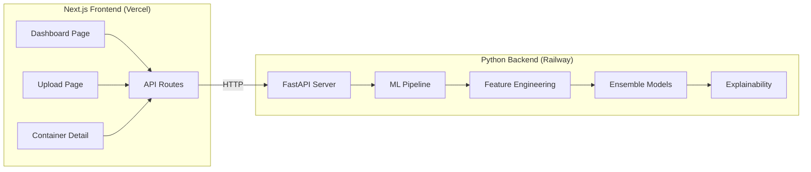

# SmartContainer Risk Engine — Implementation Plan

## Overview

Build a **full-stack SmartContainer Risk Engine** for the HACKaMINeD hackathon. Python backend (ML pipeline + FastAPI) + Next.js frontend (dashboard + upload).

**Time budget**: ~42 hours | **Team**: 4 members | **Deadline**: March 7, 11:00 AM IST

---

## Architecture

**Why this architecture?**
- Next.js API routes proxy to Python backend → single frontend deployment
- Python handles all ML logic → use scikit-learn, XGBoost, SHAP natively
- Pre-computed results stored as JSON → dashboard loads instantly even if backend is slow

---

## Proposed Changes

### ML Pipeline (Python Backend)

#### [NEW] [requirements.txt](file:///d:/HACKaMINeD%20Prototype%20Zero/Prototype-Zero/requirements.txt)
Dependencies: `pandas`, `numpy`, `scikit-learn`, `xgboost`, `lightgbm`, `shap`, `fastapi`, `uvicorn`

---

#### [NEW] [loader.py](file:///d:/HACKaMINeD%20Prototype%20Zero/Prototype-Zero/src/data/loader.py)
- Load CSVs, validate schema, normalize date formats (DD-MM-YYYY vs YYYY-MM-DD)
- Type casting and basic sanity checks

#### [NEW] [preprocessor.py](file:///d:/HACKaMINeD%20Prototype%20Zero/Prototype-Zero/src/data/preprocessor.py)
- Handle edge cases (zero weights, zero values)
- Label encode categoricals (Origin_Country, Shipping_Line, etc.)
- Map `Clearance_Status` → numeric target: Clear=0, Low Risk=1, Critical=2

---

#### [NEW] [engineering.py](file:///d:/HACKaMINeD%20Prototype%20Zero/Prototype-Zero/src/features/engineering.py)
**40+ features** in these categories:

| Category | Features |
|---|---|
| **Weight** | `weight_diff_pct`, `weight_diff_abs`, `is_overweight`, `is_underweight`, `weight_ratio` |
| **Value** | `value_per_kg`, `log_value`, `is_zero_value`, `value_zscore` |
| **HS Code** | `hs_chapter` (first 2 digits), `hs_heading` (first 4), `hs_chapter_risk_rate` |
| **Time** | `hour`, `day_of_week`, `is_weekend`, `is_night` (22:00-06:00), `month` |
| **Dwell** | `dwell_zscore`, `dwell_vs_port_avg`, `is_long_dwell` |
| **Behavioral** | `importer_avg_value`, `importer_risk_rate`, `exporter_risk_rate`, `importer_freq` |
| **Route** | `origin_risk_score`, `route_pair_freq`, `country_value_ratio` |
| **Interaction** | `value_x_weight_diff`, `dwell_x_value_zscore` |

#### [NEW] [behavioral.py](file:///d:/HACKaMINeD%20Prototype%20Zero/Prototype-Zero/src/features/behavioral.py)
- Build historical profiles for importers/exporters
- Calculate rolling risk rates, avg values, frequency
- Cross-reference against historical data for real-time inference

---

#### [NEW] [xgboost_model.py](file:///d:/HACKaMINeD%20Prototype%20Zero/Prototype-Zero/src/models/xgboost_model.py)
- XGBoost with `scale_pos_weight` for class imbalance
- Stratified 5-fold CV
- Hyperparameter tuning (max_depth, learning_rate, n_estimators)

#### [NEW] [lgbm_model.py](file:///d:/HACKaMINeD%20Prototype%20Zero/Prototype-Zero/src/models/lgbm_model.py)
- LightGBM with `is_unbalance=True`
- Same CV strategy

#### [NEW] [anomaly.py](file:///d:/HACKaMINeD%20Prototype%20Zero/Prototype-Zero/src/models/anomaly.py)
- **Isolation Forest** on feature space
- **Statistical** Z-score outlier detection on key columns
- **Domain rules**: weight diff >15%, value=0 with high weight, unusual dwell times
- Output: composite anomaly score (0-1)

#### [NEW] [ensemble.py](file:///d:/HACKaMINeD%20Prototype%20Zero/Prototype-Zero/src/models/ensemble.py)
- Weighted average: `0.4 * XGBoost + 0.35 * LightGBM + 0.25 * AnomalyScore`
- Final Risk_Score (0-100)
- Threshold-based categorization: Critical (>70) / Low Risk (≤70)

---

#### [NEW] [shap_explainer.py](file:///d:/HACKaMINeD%20Prototype%20Zero/Prototype-Zero/src/explainability/shap_explainer.py)
- SHAP TreeExplainer for XGBoost/LightGBM
- Extract top 3 contributing features per prediction

#### [NEW] [rule_explainer.py](file:///d:/HACKaMINeD%20Prototype%20Zero/Prototype-Zero/src/explainability/rule_explainer.py)
- Convert SHAP features + anomaly flags → natural language
- Example: *"High risk: Weight discrepancy of 23.5% detected. Importer has 12% historical critical rate. Unusually high value-to-weight ratio."*

---

#### [NEW] [train.py](file:///d:/HACKaMINeD%20Prototype%20Zero/Prototype-Zero/src/train.py)
- Full training pipeline: load → preprocess → engineer features → train models → save
- Save models as `.joblib` files

#### [NEW] [pipeline.py](file:///d:/HACKaMINeD%20Prototype%20Zero/Prototype-Zero/src/pipeline.py)
- Full inference: load data → features → predict → explain → output CSV + JSON

---

#### [NEW] [main.py](file:///d:/HACKaMINeD%20Prototype%20Zero/Prototype-Zero/api/main.py)
FastAPI endpoints:
- `POST /predict` — accepts CSV upload, returns predictions JSON
- `GET /results` — returns pre-computed predictions
- `GET /stats` — returns dashboard statistics
- `GET /container/{id}` — returns single container detail

---

### Next.js Frontend

#### [NEW] Next.js app in `dashboard/` directory
Initialized with `npx create-next-app@latest`

Key pages:
- **`/`** — Dashboard overview (risk distribution pie chart, top critical containers table, key stats cards)
- **`/containers`** — Searchable/filterable table of all containers with risk levels
- **`/containers/[id]`** — Detailed view of a single container with SHAP explanation
- **`/upload`** — CSV file upload → trigger prediction → show results
- **`/analytics`** — Deep analytics (origin country heatmap, HS code risk, timeline charts)

**Design**: Dark glassmorphism theme, vibrant accent colors (cyan/purple gradients), smooth animations, **Chart.js** or **Recharts** for visualizations.

---

## Verification Plan

### Automated Tests
1. **ML Pipeline validation** — Run `python src/train.py` and verify:
   - Model trains without errors
   - Stratified CV accuracy > 85%
   - Predictions CSV generated with correct schema (`Container_ID`, `Risk_Score`, `Risk_Level`, `Explanation_Summary`)
   
2. **Inference on Real-Time data** — Run `python src/pipeline.py` and verify:
   - All 8,481 containers get predictions
   - Risk_Score in range 0-100
   - Risk_Level is either "Critical" or "Low Risk"
   - Every row has a non-empty Explanation_Summary

3. **API tests** — Start FastAPI with `uvicorn api.main:app` and test:
   - `curl http://localhost:8000/results` returns valid JSON
   - `curl -X POST -F "file=@Problem/Real-Time Data.csv" http://localhost:8000/predict` returns predictions

### Browser Verification
4. **Next.js dashboard** — Run `npm run dev` in dashboard folder and verify in browser:
   - Dashboard loads with charts and statistics
   - Container table is searchable and filterable
   - Upload page accepts CSV and shows predictions
   - All pages are responsive and visually polished

### Manual Verification
5. **Spot-check predictions** — Manually verify 5-10 containers:
   - Containers with large weight discrepancies should have higher risk scores
   - Containers with zero declared value should be flagged
   - Explanations should be human-readable and relevant
6. **Deployment** — Verify deployed URLs load correctly and API responds
